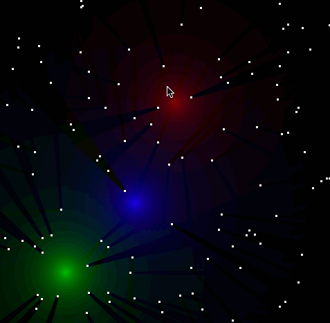

# gl2dl

Minimalistic OpenGL Python game library. Name is temporary. It has never been
finished but already provides some interesting lighting system:

# development

Install locally in development mode:

    # use pip
    pip install -e .
    # or setup.py script
    python setup.py develop
